

# **Machine Learning: Final Project Report (Team 9)** 
# **NBA Salary Analysis with Machine Learning**

**陳啓恩 (A1103316) 
辜煒程 (A1103311) 
萬	 柏	  彥             (A1113363)**

# **January 6, 2025**
1. ## **Introduction**
   本分析的目的是運用機器學習技術，根據NBA球員的表現數據預測其薪資。預測目標是根據球員的比賽統計數據，如得分、助攻、籃板等，來估算其在聯盟中的薪資水平。這樣的預測模型不僅能幫助了解薪資決策的影響因素，還能為球隊、經紀人及分析師提供更多依據，進而做出更具依據的選擇。此分析的重要性在於薪資分配在NBA的決策過程中扮演著關鍵角色，了解哪些因素對薪資有顯著影響，能夠為球隊的薪資管理及球員的薪資談判提供更精確的數據支持。

   **預測薪資的動機與重要性**

預測NBA球員薪資不僅能幫助球隊做出更加理性和高效的決策，還能提供更深刻的市場洞察。在NBA這樣的高競爭、高薪資的聯賽中，薪資空間（cap room）和奢侈稅（luxury tax）等規範對球隊的經濟策略具有重大影響。球隊需要在有限的薪資空間內選擇適合的球員，並管理好球員薪資的結構。而選秀順位（draft picks）則往往代表著球員的潛力和未來價值，這使得新秀的薪資水平成為球隊決策的重要參數。

此外，第一層奢侈稅線（the first apron）也是影響薪資結構的一個關鍵因素，因為球隊如果超過這一線，將面臨更多的財務限制和競爭壓力。因此，精確預測球員薪資不僅能幫助球隊在薪資空間內做出更有戰略意圖的選擇，還能幫助球隊在選秀及自由市場中做出更具成本效益的選擇。

此外，薪資專家（cap experts）在NBA球隊中扮演著至關重要的角色，他們專門負責制定薪資策略，確保球隊能夠在不違反聯盟規定的情況下，盡可能優化薪資結構。預測薪資的準確性對於薪資專家來說極為重要，能夠協助他們作出更精確的預算規劃和策略調整。
## **1.1 Objectives of this study**
## `	`目標一：嘗試透過機器學習方法，找出球員的各項數據與球員薪資是否有某種趨勢或關係，進一步分析球員市場。
目標二：協助球隊管理層決策，幫助其在球員補強、陣容規劃及薪資帽優化方面做出更具策略性的策略。
## **1.2 Data Descriptions**
原始資料集來自<https://www.basketball-reference.com/>，提供了 NBA 球員整個 2023/2024 賽季的綜合表現統計數據，包括一般數據與進階數據，加上自己爬蟲<https://hoopshype.com/salaries/players/>、https://www.spotrac.com/網站，抓取出2024/2025仍有合約/薪資的球員薪資，結合成一個新的資料集，包含球員數據與薪資。

原始資料集的欄位有572筆，刪除24/25沒有薪水的球員後，最終包含426筆，其中包括51個變數，其中有3個categorical variable以及48個numerical variables。Response variable為salary。

相較於期中報告，本次新增了球員進階數據，包括VORP、WS、OWS等

此處將變數以功能形式分組，劃分為：一般指標general、得分指標scoring、進階指標advanced、組織指標playmaking、籃板指標rebounding、防守指標defense。

general <- c("MP", "GS", "GP", "Age")

scoring <- c("PTS", "FG", "FGA", "2P", "2PA", "3P", "3PA", "FT", "FTA", "TS%", "eFG%","PPG")

advanced <- c("VORP", "WS", "OWS", "DWS", "USG%", "OBPM", "DBPM", "BPM", "PER", "WS/48")

playmaking <- c("Assists", "Turnovers", "AST%", "TOV%")

rebounding <- c("TRB", "DRB", "ORB", "TRB%", "ORB%", "DRB%")

defense <- c("Steals", "Blocks", "Personal\_Fouls", "STL%", "BLK%")

1. ## **Exploratory Data Analysis**
   ## 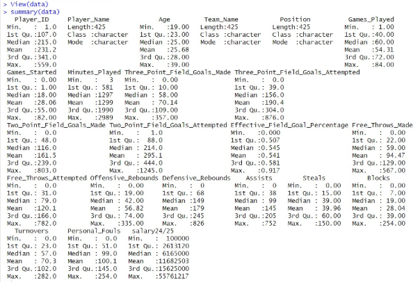
   1. ## **Data Cleaning**
      1. ## **Missing Value**
以[https://www.basketball-reference.com](https://www.basketball-reference.com/leagues/NBA_2024_advanced.html)網站為主，kaggle資料集為輔，比對有薪水的球員。且如果球員在賽季中有轉隊紀錄，將會保留球員在兩個隊伍中的數據總和，並以2TM、3TM形式註記。

約有100個球員在24/25賽季沒有薪水紀錄，可能未獲得報價或合約，因此將這些球員剔除。
## **2.2 Assess Data Distributions**
## **2.2.1 Categorical variables**
 Salary by position
## **2.2.2 Numerical Variables**
## **Distribution of NBA Player Salaries**
## 
## 
## 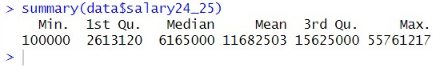
## 
1. ## **Exploring Variable Correlations with Salary**
   ## 
1. ## **Feature Engineering**
依照指標將變數分組，且只找出與薪水高度相關的變數，並排除彼此相關係數大於0.6以上的變數。避免多重共線性。

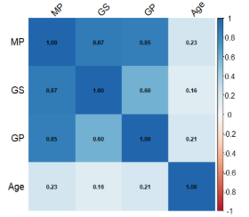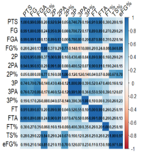
##
## 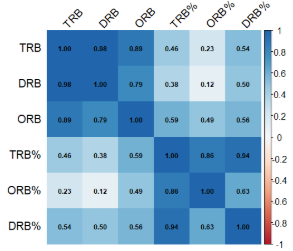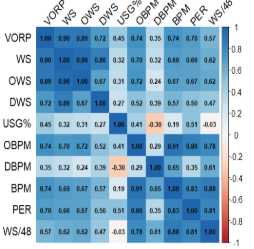
## 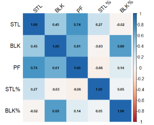
## **2.4 Data Preparation**
- **Feature Selection**：

  **法一：使用相關係數**

  **法二：elastic net**
## **2.5 Data Partition**
使用K-fold cross validation，K設定為5，並將training set與testing set分成4:1。

可以降低overfitting的風險

1. ## **Model Building & Analysis**
   1. ## **Model Selection**
本次分析採用Ridge Regression、Elastic Net與Random Forest三種模型進行預測。由於在前處理階段已經進行了共變異分析和特徵選擇，因此選擇Ridge Regression模型。Ridge Regression通過對參數進行正規化，使得λ值越大，懲罰力度越強，從而有效避免過擬合並解決多重共線性問題。

為了全面評估變數篩選的效果，並避免偏見，我們同時使用Elastic Net進行變數篩選，並比較手動選擇變數與機器選擇變數的差異及其原因。

最後，為了提高預測精度，我們選擇了更為強大的Random Forest模型，並進行Grid Search調參，對比直接訓練模型與經Elastic Net篩選後的變數組合，分析兩者在預測誤差上的差異。
1. ## **Model Implementation**
   1. ## **Ridge Regression**
## 首先對所有數值型變數做Z-score標準化，排除目標變數salary。以及採用k-fold cv，k選擇5，5是最常用的。Ridge Regression會使用λ超參數，採用cross-vaildation選擇最佳的λ值，使交叉驗證誤差最小。
## 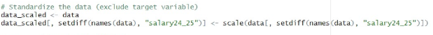
## 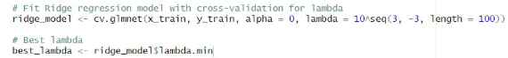
1. ## **Elastic net**
為了避免先入為主，我們使用elastic net重新做一次Feature Seletion，讓模型自動找出重要變數且用於接下來的分析。

同樣使用k-fold，k = 5，找出best alpha與lambda，程式碼與ridge Regression都相同。

Best alpha為5 fold的average alpha

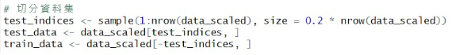

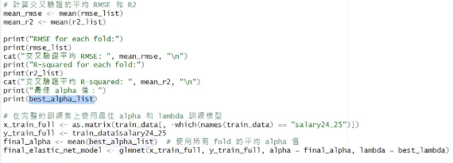
1. ## **Random Forest**
使用pyhon scikit-learn套件實作隨機森林，首先先將資料集以8:2，拆分成訓練集與測試集。並設隨機種子保證條件一致。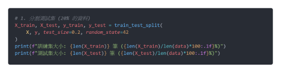

接著定義隨機森林的超參數可選範圍，用於下個步驟的GridSearchCV

- n\_estimators: [50, 100, 150, 200]：決策樹的數量
- max\_depth: [None, 10, 15, 20, 30]：樹的最大深度
- min\_samples\_split: [2, 5, 10]：內部節點再劃分所需的最小樣本數
- min\_samples\_leaf: [1, 2, 4]：葉節點最少樣本數
- max\_features: [None, 'sqrt']：最大特徵數，控制每次劃分，隨機森林可以選擇多少特徵。

在grid search中使用kFold，且K設定為5，目的是希望確保每個子集都能當作訓練集，減少因資料分配導致的偶然偏差。

在 GridSearchCV 中，每一組超參數的組合都會訓練一次隨機森林模型，並使用均方誤差（MSE）作為評估指標進行參數搜尋，目的是找出能最小化誤差的最佳超參數組合。

開始執行網格搜尋，並結束後印出訓練集中最佳參數組合與RMSE

透過損失函數找到最佳參數組合後，使用該組參數，訓練出最佳的隨機森林模型best\_rf。並使用預先切割好，獨立的測試集X\_test與y\_test，使用該模型預測薪水，並列印出結果。

1. ## **Model Result**
   1. ## **Ridge Regression**
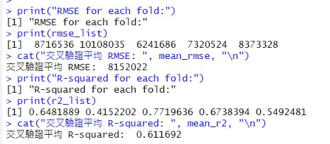Ridge regression模型採用的loss function為RMSE與R-squared

RMSE：均方根誤差，因為預測目標變數是薪水，RMSE的單位會與薪水一致，如果選擇MSE會造成MSE過大且難以解釋。

在K-fold的平均RMSE為81152002

平均R-square為0.611
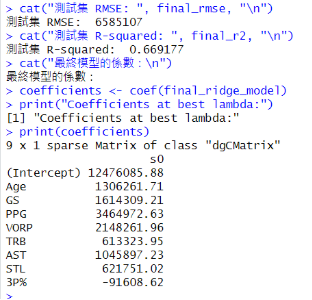

在模型未看過的資料，也就是在測試集上的RMSE誤差為：6,585,107

R-squared：會介在0~1之間，可以反映特徵與目標變數變異的解釋能力，上圖表示在測試集上的 R-squared約為0.66，表示為模型中度解釋

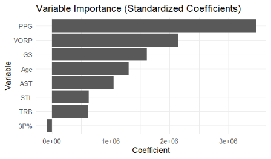

變數重要度，PPG最高，依序為VORP，GS，Age、STL、TRB

3P%與薪水反而呈現負相關。

1. ## **Elastic net**
## 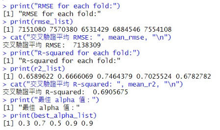
在訓練集與驗證集中，5折的平均RMSE為：**7,138,309**；平均R-square為**0.69**

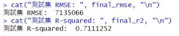

在獨立的測試集中，RMSE為：**7,135,066**；R-square為：**0.71**

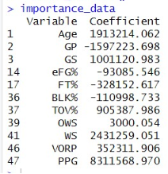印出Elastic net的變數重要度

1. ## **Random Forest**
隨機森林模型使用MSE作為挑選超參數組合的損失函數，最終模型的指標為RMSE與R-squared：

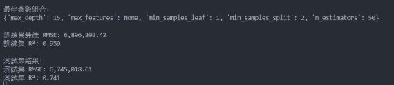

模型在訓練集的最終結果為RMSE：**6,896,202** ; R-square為0.959

在測試集的最終結果為RMSE：**6,745,018** ;  R-square為**0.741**，模型解釋了 **74.1%** 的變異性。

。實際與預測圖

Random Forest的重要性變數圖，可以發現PPG (均分)對薪水的預測的重要性非常高。其次為Age (年齡)、FG (進球數)、TOV% (失誤率)、GS (先發場次)、STL (搶斷)、PF (犯規次數)

如果只使用Elastic net找出的變數放入隨機森林訓練。

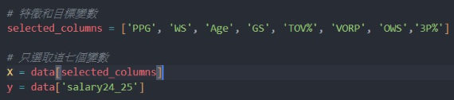

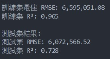 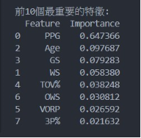

可以發現在訓練集與測試集的誤差都有下降。

||訓練集RMSE|訓練集R²|測試集RMSE|測試集R²|
| :- | :- | :- | :- | :- |
|無事前feature Selection|**6,896,202**|0\.959|**6,745,018**,|0\.741|
|使用elastic net做 feature Selection|**6,595,051**|**0.965**|**6,072,566**|**0.728**|

1. ## **Conclusions**
   這次研究透過機器學習技術，探討了NBA球員數據和薪資之間的關聯，並比較了Ridge Regression、Elastic Net以及Random Forest三種模型的表現。 Ridge Regression在處理多重共線性問題上很有幫助，但它只能捕捉變數與薪資之間的線性關係，對於NBA這樣複雜的數據環境，效果會有些局限。而Elastic Net則進一步加入了變數篩選功能，能有效挑出影響薪資的核心指標。不過，Elastic Net同樣受限於線性假設，無法全面反映球員數據的非線性交互。

   相比之下，Random Forest的表現則更為突出。它能捕捉數據中的非線性關係，並指出像得分（PPG）、搶斷（STL）和籃板（TRB）這些指標對薪資的影響最為明顯。同時，我們也發現三分命中率（3P%）與薪資的負相關性，這與我們對當前對三分球重要性的認知有些矛盾，可能暗示了市場需求或其他未考慮的因素影響。

   這些模型各有優勢，但也有明顯的不足。Ridge和Elastic Net雖然簡單高效，但在處理複雜的數據時效果有限；而Random Forest雖然強大，但也需要更高的計算資源，並且容易受到過多無關變數的影響。我們結合Elastic Net進行變數篩選後，再使用Random Forest進行建模，成功減少了過擬合問題，讓預測更加精準。

   未來的研究可以更細緻地分析不同位置球員的薪資模型，因為控衛、中鋒等位置對技能的需求不同，影響薪資的因素也可能各異。此外，將球隊策略、市場偏好等外部因素加入模型，應該能讓薪資預測更全面、更貼近實際。

   總之，這次研究不僅驗證了機器學習技術在運動數據分析中的潛力，也為球隊和經紀人在薪資管理和決策方面提供了新的數據支持。

1. ## **Reference**
   [Predictive Modeling of NBA Player Salaries Using Machine Learning](https://medium.com/@dwang22/predictive-modeling-of-nba-player-salaries-using-machine-learning-techniques-36b6ab71d11b)

   <https://github.com/aishwarya-pawar/NBA-Players-Salary-Prediction>

   <https://www.basketball-reference.com/leagues/NBA_2024_advanced.html>

   [Predicting NBA Player Salaries for the 2022–23 Season](https://python.plainenglish.io/predicting-2022-23-nba-player-salaries-13bed1a6723e)

   <https://www.youtube.com/watch?v=hyo5_dYjF0o>
